# Findi Mermaid Flows

Generated from the Findi Feature Specification, updated 29 July 2026.

## 1. Findi Platform Ecosystem

One shared account system and backend serve the public website, customer app, supplier portal, fundraising portal and admin console.

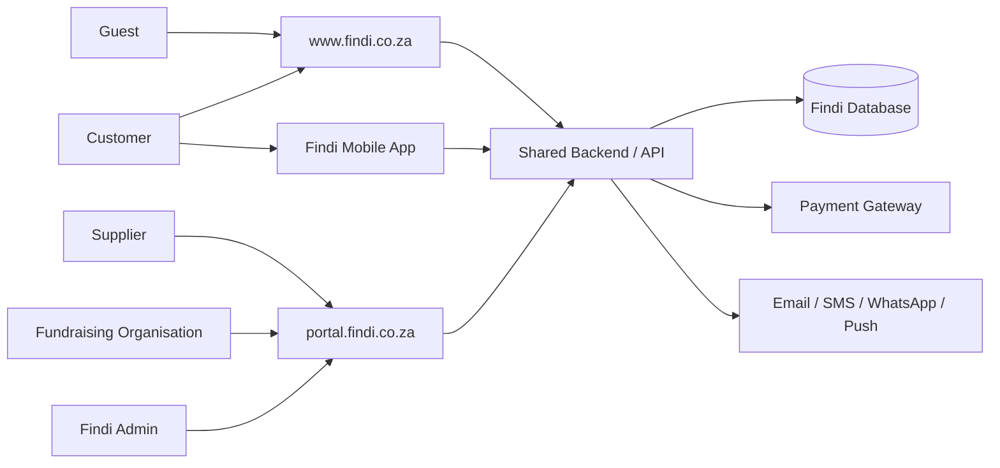

## 2. Customer Discovery to Collection Journey

The customer makes one payment even when the basket contains products from several suppliers.

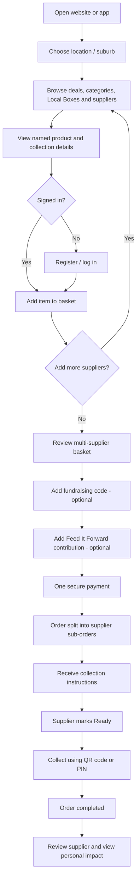

## 3. Community Seller Application and Category Gating

Approval is category-specific. Findi adds a professional storefront without replacing the seller’s existing WhatsApp or community network.

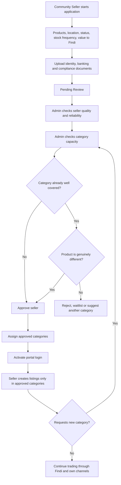

## 4. Supplier Listing and Order Fulfilment

Supplier actions remain simple while the platform handles payment, commission, refunds and reporting.

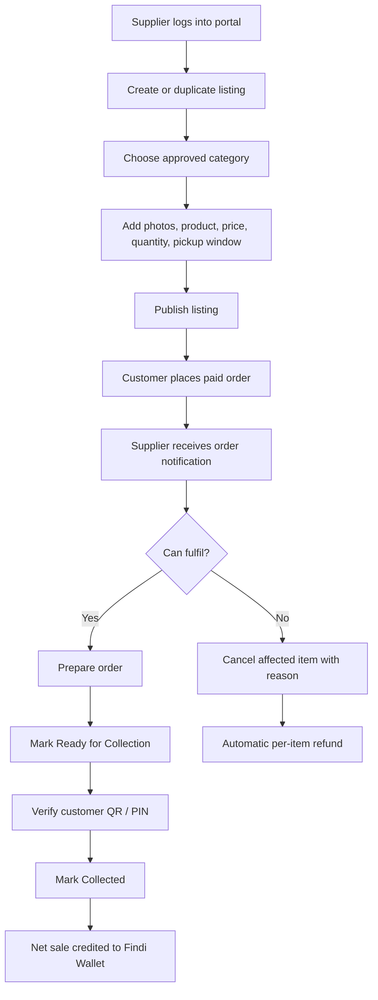

## 5. Multi-Supplier Checkout and Payment Split

The architecture must split one transaction into supplier, commission, donation and fundraising ledger entries from day one.

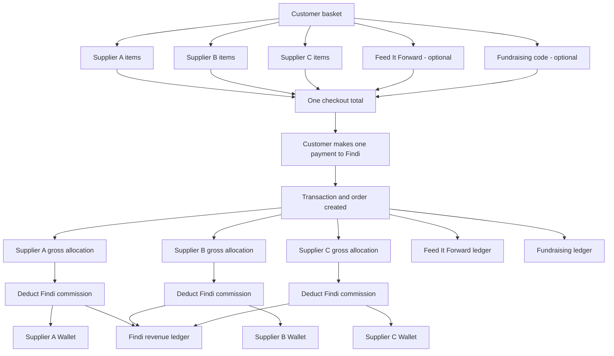

## 6. Weekly Supplier Payout Cycle

Weekly payouts reduce transaction-level administration while preserving transparent per-order statements and wallet balances.

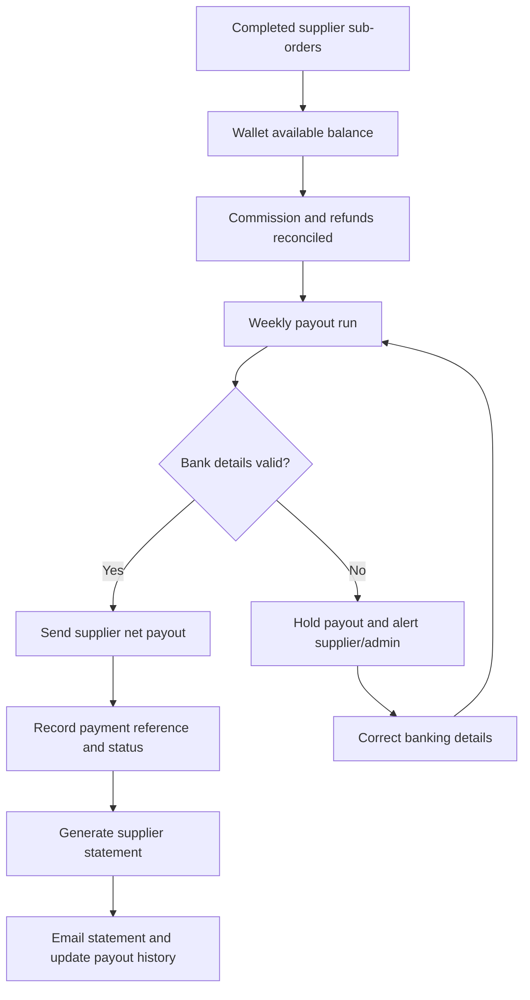

## 7. Feed It Forward Contribution and Disbursement

Feed It Forward must remain separate from Findi turnover and commission, with recipient, amount, date and approver recorded.

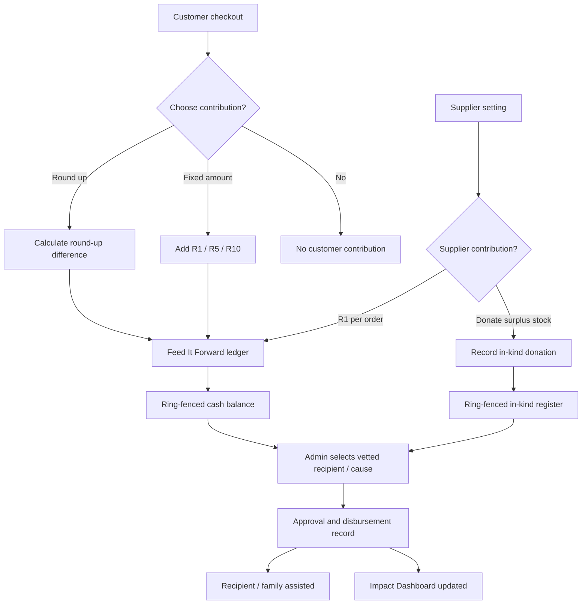

## 8. Fundraising Organisation Flow

The supplier share is unaffected; the fundraising amount comes from Findi’s commission.

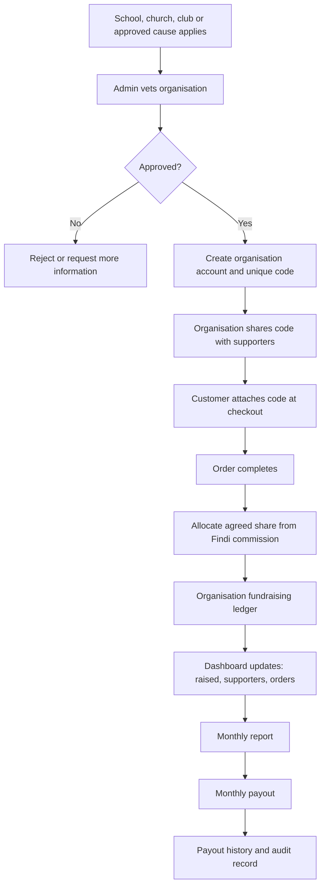

## 9. Admin Operating Flow

A role-based admin console provides one operational view while keeping each financial ledger distinct.

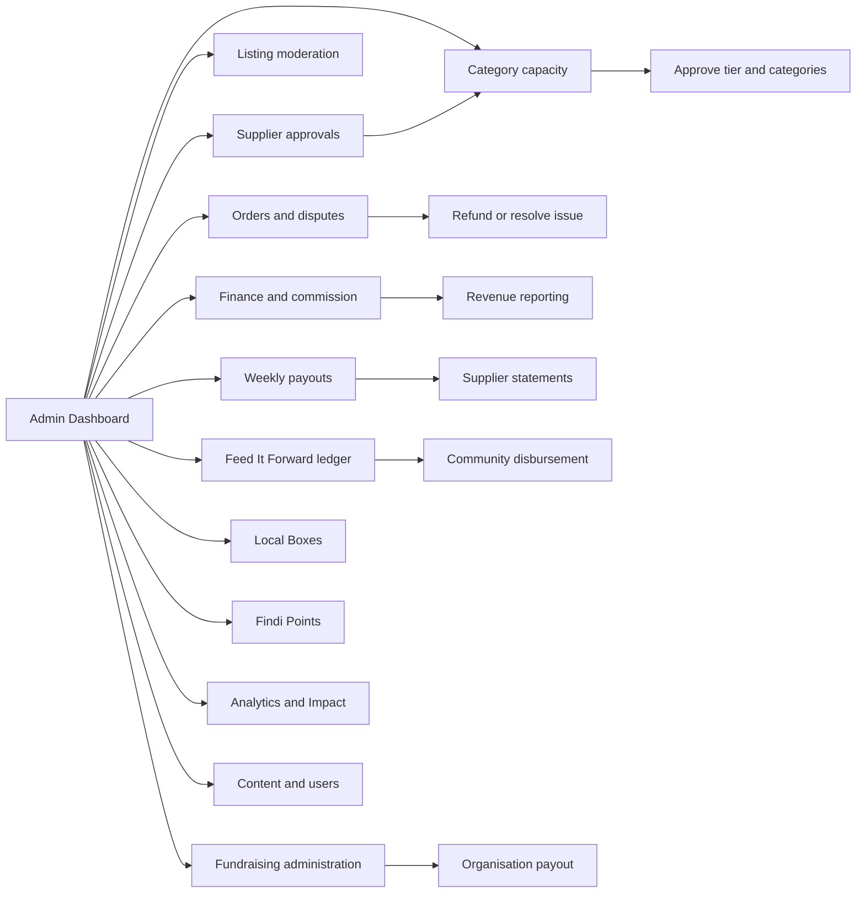

## 10. Local Box Creation and Fulfilment

Local Boxes are a curated presentation layer built on the same multi-supplier basket and payment architecture.

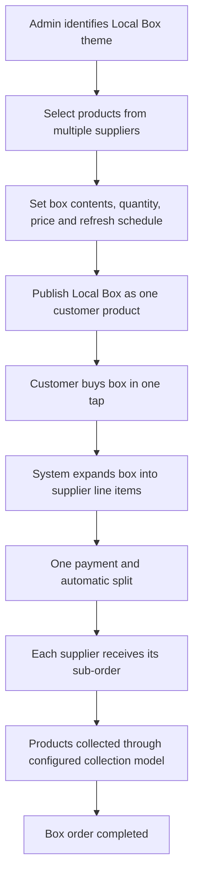

## 11. Exception, Cancellation and Partial Refund Flow

The platform must refund one supplier’s item without cancelling unrelated items from other suppliers.

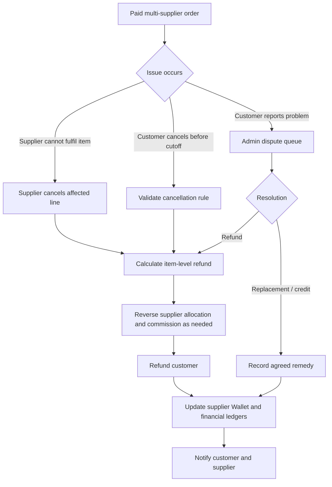

## 12. Architecture-First Roadmap

Build the relationships into the schema now, even when some customer-facing screens activate later.

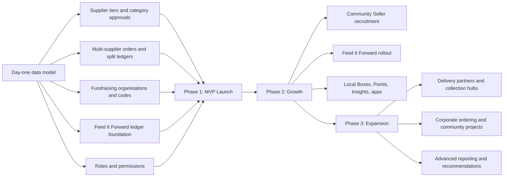

